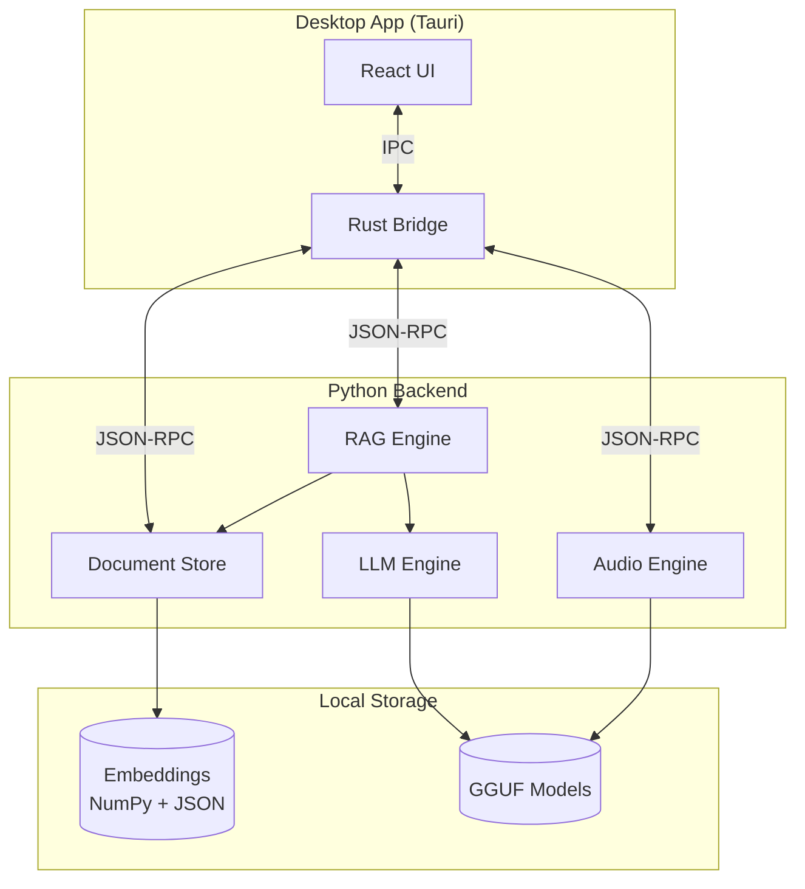
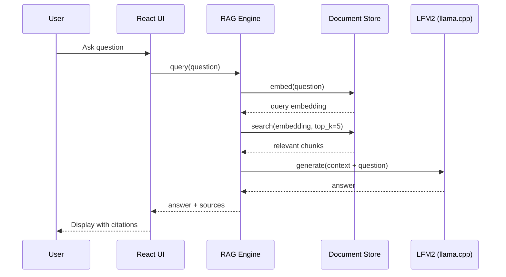

# Private Doc Q&A

Query your private documents (tax returns, medical records, contracts) with AI — 100% on-device. Nothing is ever uploaded.

Built with [Liquid AI's LFM2](https://www.liquid.ai/) models running locally via llama.cpp.

## Why this exists

I wanted to ask questions about my W-2s, medical records, and contracts without uploading them to ChatGPT or Claude. Existing solutions are either cloud-based (privacy concern) or enterprise-only ($50K+). This runs entirely on a Mac with zero network calls after setup.

## Features

- **100% local processing** — All AI inference happens on-device using LFM2 models. No API keys, no cloud, works offline.
- **Voice and text input** — Ask questions naturally. LFM2-Audio handles transcription locally (~300ms latency).
- **Multi-document search** — Index PDFs, DOCX, TXT files and query across all of them at once.
- **Source citations** — Every answer shows which document(s) and page(s) it came from, with confidence scores.
- **Native Mac app** — Tauri-based desktop app with drag-and-drop, or use the CLI.

## Architecture



### Query Flow



## Installation

### Requirements

- macOS 12+ on Apple Silicon (M1/M2/M3/M4)
- 8GB RAM minimum (16GB recommended)
- Python 3.10+
- Node.js 18+
- Rust (for Tauri)
- ~5GB disk space for models

### Setup

```bash
# 1. Clone
git clone https://github.com/csanghvi-stripe/private-doc-qa.git
cd private-doc-qa

# 2. Run setup (creates dirs, installs Python deps)
python setup.py

# 3. Download models from HuggingFace to models/
#    - LFM2-1.2B-Q4_K_M.gguf (730MB) from LiquidAI/LFM2-1.2B-GGUF
#    - For voice: LFM2-Audio models from LiquidAI/LFM2-Audio-1.5B-GGUF

# 4. Install llama.cpp
brew install llama.cpp

# 5. Run desktop app
cd desktop
npm install
npm run tauri dev
```

Or use CLI mode: `python main.py`

## Usage

### Desktop App

1. Launch the app (`npm run tauri dev` or from Applications after building)
2. Drag documents into the window or click "Add Documents"
3. Wait for indexing (progress shown in sidebar)
4. Type or speak your question
5. View answer with source citations

### CLI

```bash
python main.py                    # Interactive mode
python main.py --docs ~/taxes     # Custom docs folder
python main.py --mock             # Test without models
python main.py -v                 # Verbose logging
```

## Project Structure

```
private-doc-qa/
├── core/                    # Python backend
│   ├── document_store.py    # Chunking, embeddings, vector search
│   ├── rag_engine.py        # Retrieval-augmented generation
│   ├── llm_engine.py        # LFM2 inference via llama.cpp
│   └── audio_engine.py      # Voice transcription
├── parsers/                 # PDF, DOCX, TXT parsing
├── desktop/                 # Tauri + React app
│   ├── src/                 # React frontend
│   └── src-tauri/           # Rust bridge to Python
├── models/                  # GGUF files (gitignored)
└── data/                    # User documents & index (gitignored)
```

## Performance

Tested on M4 Pro with Apple silicon using llama.cpp:

- **Indexing:** ~2s per page
- **Voice transcription:** ~300ms
- **Vector search:** <50ms
- **Answer generation:** 500-1500ms
- **Total query time:** <2s

Memory usage: ~4GB while running

## Privacy

All data stays on your machine:

- Documents stored in `data/docs/`
- Embeddings stored in `data/index/`
- Queries exist only in memory
- Audio recordings are temp files, deleted after transcription
- Zero network calls after initial model download

Works in airplane mode.

## Limitations & Roadmap

This is a working prototype. Known limitations and planned improvements:

**Accuracy**
- [ ] Add reranking (cross-encoder) for better source selection
- [ ] Hybrid search (semantic + BM25) for exact matches
- [ ] Smarter chunking that respects document structure

**Performance**
- [ ] GPU offloading via Metal (currently CPU-only)
- [ ] Streaming responses
- [ ] Embedding cache for faster re-indexing

**Scalability**
- [ ] Replace NumPy with sqlite-vec or LanceDB
- [ ] Incremental indexing (only changed files)

**UX**
- [ ] Document preview in context
- [ ] Conversation history persistence
- [ ] Export answers to markdown/PDF

## Troubleshooting

| Problem | Solution |
|---------|----------|
| Model not found | Download GGUF files to `models/` |
| Runner not found | `brew install llama.cpp` |
| Out of memory | Close other apps, model needs ~4GB |
| Slow indexing | Normal for large PDFs with tables |
| No voice input | Check microphone permissions in System Settings |

Test without models: `python main.py --mock`

## Acknowledgments

- [Liquid AI](https://www.liquid.ai/) — LFM2 models
- [llama.cpp](https://github.com/ggml-org/llama.cpp) — Local inference
- [Tauri](https://tauri.app/) — Desktop framework
- [sentence-transformers](https://www.sbert.net/) — Embeddings

## License

MIT
